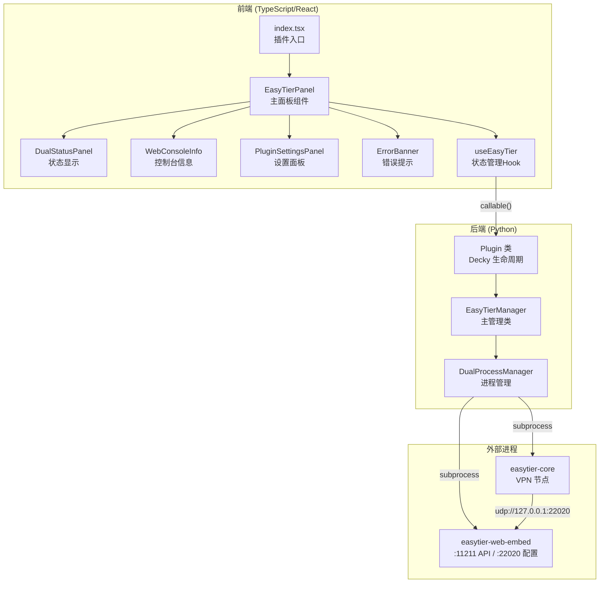
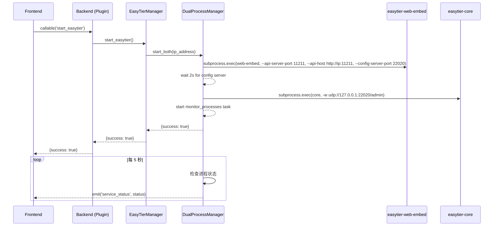

# 设计文档

## 概述

本设计对 Decky EasyTier 插件进行全面重构，目标是精简代码、修复已知问题、移除 QR 码功能，并确保核心功能稳定可靠。

重构范围：
- **后端（main.py）**：精简 `DualProcessManager` 和 `EasyTierManager`，移除 QR 码生成、冗余调试日志和节点注册监控
- **前端（src/）**：删除 `QRCodeDisplay` 组件，重构 `EasyTierPanel` 简化状态渲染，新增 `WebConsoleInfo` 组件替代 QR 码显示，修复按钮布局
- **依赖清理**：移除 `py_modules/qrcode`、`py_modules/png.py`，更新类型定义

关键设计决策：
1. 保持现有的双进程架构（web-embed + core），这是 EasyTier 的标准部署模式
2. 前端使用 `@decky/ui` 的 `ButtonItem` 组件确保按钮布局一致
3. 用简洁的文本信息面板替代 QR 码，显示 URL、默认凭据和 api-host 提示

## 架构



### 通信流程



## 组件与接口

### 后端组件

#### DualProcessManager

负责 easytier-web-embed 和 easytier-core 两个进程的生命周期管理。

```python
class DualProcessManager:
    def __init__(self, easytier_path: str):
        """初始化进程管理器"""
        
    async def start_both(self, ip_address: str) -> dict:
        """按顺序启动 web-embed 和 core 进程
        返回: {"success": bool, "error"?: str}
        """
        
    async def stop_both(self) -> dict:
        """按顺序停止 core 和 web-embed 进程
        先 SIGTERM，5秒超时后 SIGKILL
        返回: {"success": bool}
        """
        
    async def monitor_processes(self):
        """后台监控任务，每5秒检查进程状态
        - web 崩溃时停止 core
        - core 崩溃时根据设置自动重启
        - 通过 emit 推送状态更新
        """
        
    def get_status(self) -> dict:
        """返回当前进程状态
        返回: {"web_status": str, "core_status": str}
        """
```

#### EasyTierManager

插件主管理类，协调安装、启停和配置。

```python
class EasyTierManager:
    def __init__(self):
        """初始化路径和默认配置"""
        
    async def init(self):
        """初始化：创建目录、加载配置、初始化进程管理器、获取IP"""
        
    async def install_easytier(self) -> dict:
        """下载ZIP、解压、设置权限
        返回: {"success": bool, "error"?: str}
        """
        
    async def start_easytier(self) -> dict:
        """启动服务（不再生成QR码）
        返回: {"success": bool, "error"?: str}
        """
        
    async def stop_easytier(self) -> dict:
        """停止服务"""
        
    async def get_combined_status(self) -> dict:
        """获取组合状态（不再包含 qr_code 字段）"""
        
    async def save_plugin_settings(self, settings: dict) -> dict:
        """保存设置到 JSON 文件"""
        
    async def load_plugin_settings(self):
        """从 JSON 文件加载设置"""
        
    async def cleanup(self):
        """清理资源，停止进程"""
```

#### Plugin 类（Decky 接口）

```python
class Plugin:
    async def _main(self): """插件加载"""
    async def _unload(self): """插件卸载"""
    async def _uninstall(self): """插件卸载安装"""
    
    # 前端可调用的 API
    async def get_combined_status(self) -> dict
    async def install_easytier(self) -> dict
    async def start_easytier(self) -> dict
    async def stop_easytier(self) -> dict
    async def save_plugin_settings(self, settings: dict) -> dict
    async def load_plugin_settings(self) -> dict
```

### 前端组件

#### EasyTierPanel（重构）

主面板组件，根据状态渲染不同界面。

```typescript
// 状态 -> 渲染映射
// uninstalled -> 安装界面（下载按钮 + 进度条）
// stopped     -> 已停止界面（启动按钮 + 设置面板）
// running     -> 运行中界面（状态面板 + 控制台信息 + 停止按钮）
// partial     -> 部分运行界面（状态面板 + 警告 + 停止按钮）
// error       -> 错误界面（错误信息 + 状态面板 + 停止按钮）
```

#### WebConsoleInfo（新增，替代 QRCodeDisplay）

显示 Web 控制台访问信息，替代已移除的 QR 码组件。

```typescript
interface WebConsoleInfoProps {
  ip?: string;
}

// 显示内容：
// 1. 访问 URL: http://{ip}:11211
// 2. 默认凭据: admin / admin
// 3. 提示: api-host 需填写 Steam Deck IP
// 4. 复制 URL 按钮
```

#### DualStatusPanel（精简）

移除 `node_count` 显示，简化为纯状态展示。

#### PluginSettingsPanel（保持）

保持现有功能，仅在停止状态下显示。

#### ErrorBanner（保持）

保持现有实现。

### useEasyTier Hook（精简）

```typescript
interface UseEasyTierReturn {
  status: CombinedStatus;
  loading: boolean;
  error: string | null;
  installProgress: InstallProgress | null;
  refreshStatus: () => Promise<void>;
  installEasyTier: () => Promise<void>;
  startEasyTier: () => Promise<void>;
  stopEasyTier: () => Promise<void>;
  savePluginSettings: (settings: Partial<PluginSettings>) => Promise<void>;
}
```

移除 `nodeRegistered` 状态和 `node_registered` 事件监听。

## 数据模型

### 后端数据模型

```python
# 插件设置（持久化到 config.json）
PluginSettings = {
    "auto_start": bool,        # 默认 False
    "auto_restart_core": bool   # 默认 True
}

# 进程状态
ProcessStatus = "stopped" | "running" | "crashed" | "error"

# 组合状态（返回给前端）
CombinedStatus = {
    "overall": "uninstalled" | "stopped" | "running" | "partial" | "error",
    "web_status"?: ProcessStatus,
    "core_status"?: ProcessStatus,
    "ip"?: str,
    "plugin_settings"?: PluginSettings,
    "error"?: str
}

# API 响应
ApiResponse = {
    "success": bool,
    "error"?: str
}
```

### 前端数据模型

```typescript
// 插件设置
interface PluginSettings {
  auto_start: boolean;
  auto_restart_core: boolean;
}

// 进程状态
type ProcessStatus = 'stopped' | 'running' | 'crashed' | 'error';

// 总体状态
type OverallStatus = 'uninstalled' | 'stopped' | 'running' | 'partial' | 'error';

// 组合状态（后端返回）
interface CombinedStatus {
  overall: OverallStatus;
  web_status?: ProcessStatus;
  core_status?: ProcessStatus;
  ip?: string;
  plugin_settings?: PluginSettings;
  error?: string;
}

// 安装进度
interface InstallProgress {
  percent: number;
  message: string;
}
```

变更说明：
- 移除 `PluginSettings.log_level`（未被使用）
- 移除 `CombinedStatus.qr_code`（QR 码功能已移除）
- 移除 `CombinedStatus.node_count`（节点计数未被使用）
- 移除 `EasyTierProcessStatus` 接口（未被使用）
- 移除 `ApiResponse<T>` 泛型接口（简化为直接使用后端返回类型）


## 正确性属性

*属性是一种在系统所有有效执行中都应成立的特征或行为——本质上是关于系统应该做什么的形式化陈述。属性是人类可读规范与机器可验证正确性保证之间的桥梁。*

### Property 1: 设置保存/加载往返一致性

*For any* 有效的 PluginSettings 对象，将其保存到配置文件后再加载，应得到与原始对象等价的设置值。

**Validates: Requirements 5.3, 5.4**

### Property 2: 组合状态响应完整性

*For any* web_status 和 core_status 的组合（均为 "stopped"、"running"、"crashed"、"error" 之一），调用 get_combined_status 返回的对象应始终包含 "overall"、"ip" 和 "plugin_settings" 字段，且 overall 的值应与 web_status/core_status 的组合逻辑一致（双停止→stopped，双运行→running，web运行core停止→partial，其他→error）。

**Validates: Requirements 3.5**

### Property 3: 安装失败错误响应结构

*For any* 安装过程中的失败场景（网络错误、磁盘空间不足、ZIP 解压失败、二进制文件缺失），install_easytier 返回的响应应满足 success=False 且 error 字段为非空字符串。

**Validates: Requirements 1.4**

### Property 4: 状态显示完整性

*For any* CombinedStatus 对象（包含任意 web_status 和 core_status 组合），DualStatusPanel 组件的渲染输出应同时包含 web-embed 和 core 两个进程的状态信息。

**Validates: Requirements 3.1**

## 错误处理

### 后端错误处理

| 场景 | 处理方式 |
|------|---------|
| 网络下载失败 | 返回 `{"success": false, "error": "具体错误信息"}`，清理部分下载的文件 |
| 磁盘空间不足 | 安装前检查可用空间（≥100MB），不足时返回错误 |
| ZIP 解压失败 | 返回错误信息，清理已下载的 ZIP 文件 |
| 二进制文件缺失 | 启动前检查文件存在性，缺失时返回错误 |
| web-embed 启动失败 | 返回错误，不启动 core |
| core 启动失败 | 停止已启动的 web-embed，返回错误 |
| web-embed 运行时崩溃 | 停止 core，标记两个进程为异常状态，通过事件通知前端 |
| core 运行时崩溃 | 根据 auto_restart_core 设置决定是否自动重启 |
| 进程停止超时 | SIGTERM 后等待 5 秒，超时则发送 SIGKILL |
| 配置文件损坏 | 使用默认设置值，记录警告日志 |
| Manager 未初始化 | 所有 API 调用返回 `{"success": false, "error": "Manager not initialized"}` |

### 前端错误处理

| 场景 | 处理方式 |
|------|---------|
| API 调用异常 | 捕获异常，设置 error 状态，显示 ErrorBanner |
| 安装失败 | 显示错误信息和重试按钮 |
| 启动/停止失败 | 显示错误信息，恢复按钮可用状态 |
| 剪贴板复制失败 | 静默处理，记录 console.error |

## 测试策略

### 属性测试（Property-Based Testing）

使用 **fast-check** 库（TypeScript）和 **hypothesis** 库（Python）进行属性测试。

每个属性测试运行至少 100 次迭代。

#### Python 后端属性测试

- **Property 1**: 设置保存/加载往返一致性
  - 生成随机 PluginSettings（auto_start: bool, auto_restart_core: bool）
  - 保存到临时文件，加载后比较
  - Tag: `Feature: easytier-plugin-refactor, Property 1: Settings round-trip consistency`

- **Property 2**: 组合状态响应完整性
  - 生成随机 web_status 和 core_status 组合
  - 模拟 DualProcessManager 状态，调用 get_combined_status
  - 验证返回对象包含必需字段且 overall 逻辑正确
  - Tag: `Feature: easytier-plugin-refactor, Property 2: Combined status response completeness`

- **Property 3**: 安装失败错误响应结构
  - 生成随机失败场景（模拟不同异常类型）
  - 验证返回 success=False 且 error 非空
  - Tag: `Feature: easytier-plugin-refactor, Property 3: Installation failure error response`

#### TypeScript 前端属性测试

- **Property 4**: 状态显示完整性
  - 生成随机 CombinedStatus 对象
  - 渲染 DualStatusPanel，验证输出包含两个进程状态
  - Tag: `Feature: easytier-plugin-refactor, Property 4: Status display completeness`

### 单元测试

单元测试聚焦于具体示例和边界情况：

#### 后端单元测试
- 安装流程：ZIP 解压、文件权限设置
- 启动顺序：web 先启动，core 后启动
- 停止顺序：core 先停止，web 后停止
- 错误级联：web 崩溃导致 core 停止
- core 自动重启逻辑
- 配置文件缺失时使用默认值
- IP 地址获取逻辑

#### 前端单元测试
- 各状态界面渲染（uninstalled、stopped、running、partial、error）
- 按钮禁用状态（loading 时）
- WebConsoleInfo 组件显示正确的 URL 和凭据
- 设置面板的变更检测和保存逻辑
